# Figure 2 — Preview

## Plot 1 — COD Predictions

**1_Diff1.png**
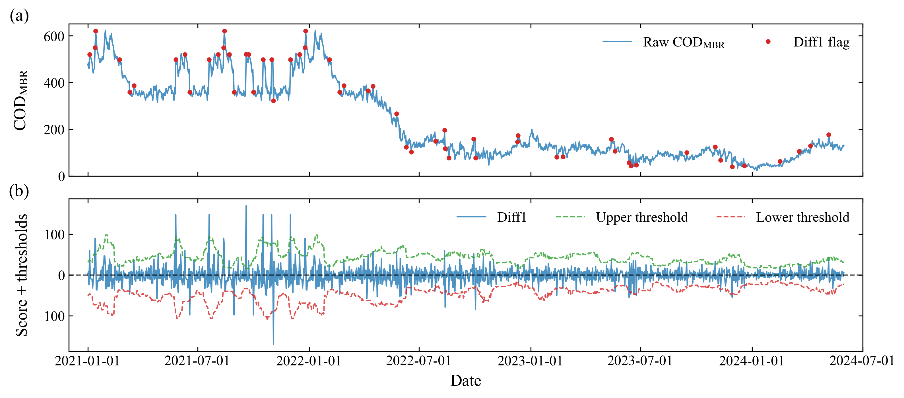

**1_Hampel.png**
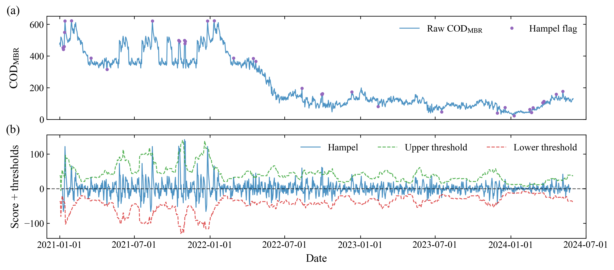

**1_STL.png**
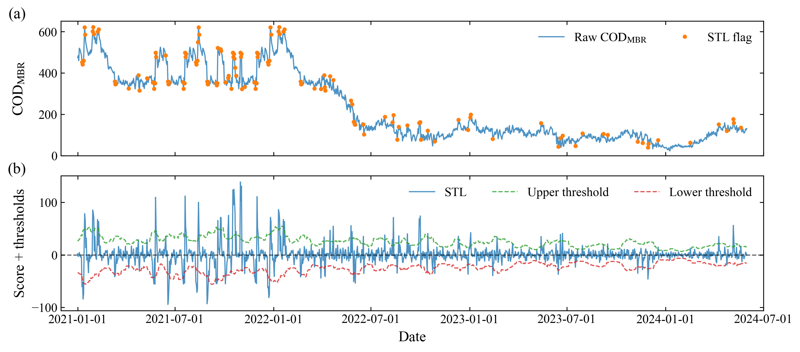

**1_Wavelet-strong.png**
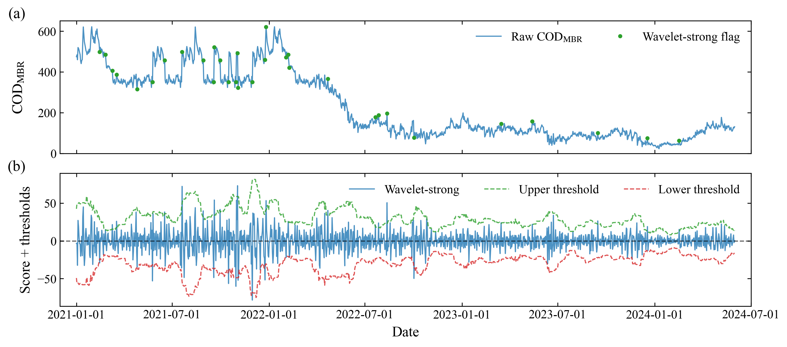

## Plot 2 — NH3N Predictions

**2_Diff1.png**
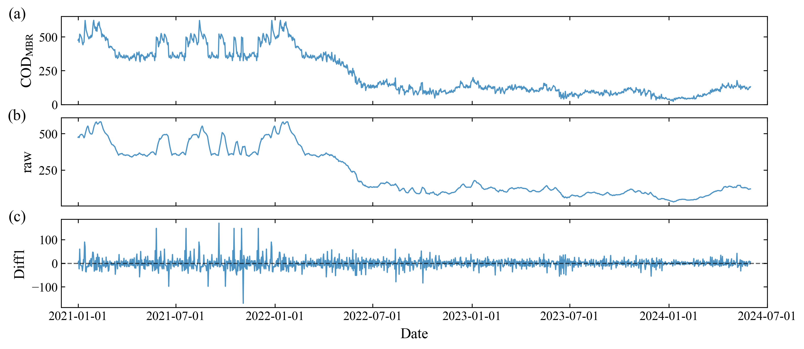

**2_Hampel.png**
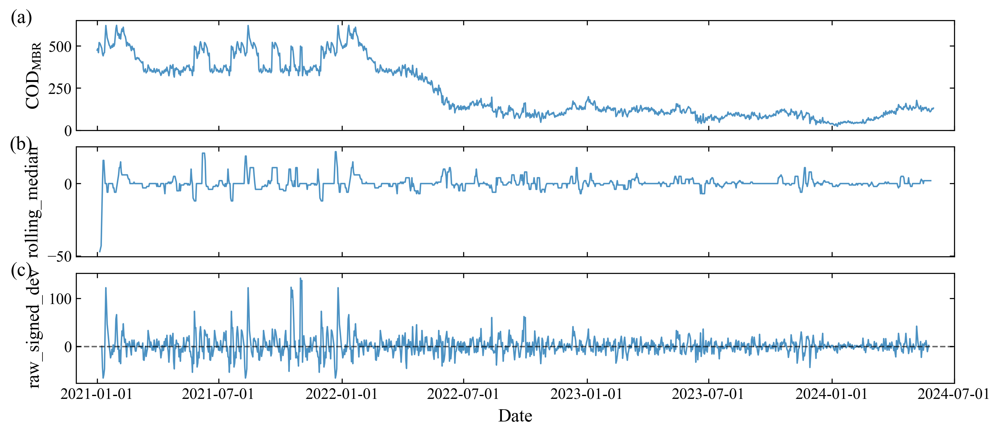

**2_STL.png**
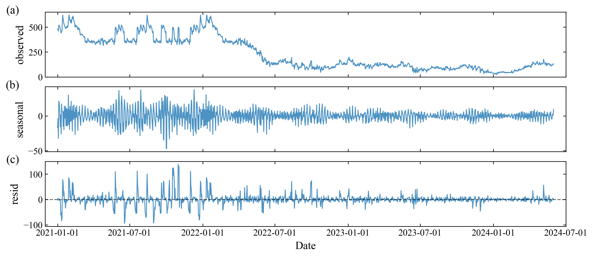

**2_Wavelet-strong.png**
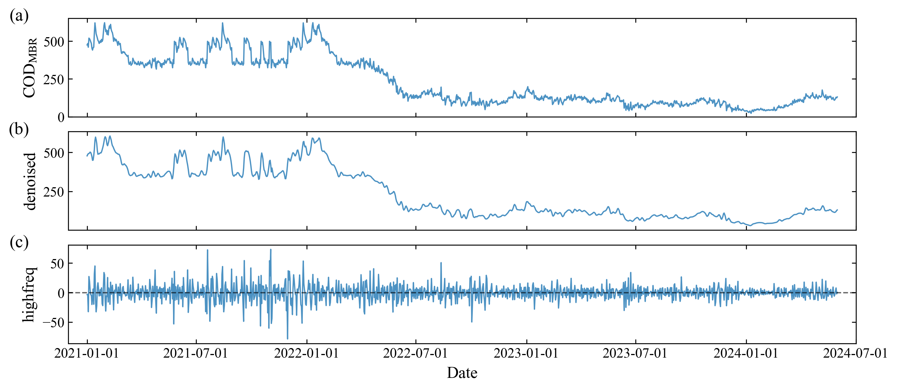

## Plot 3

**3_Hampel.png**
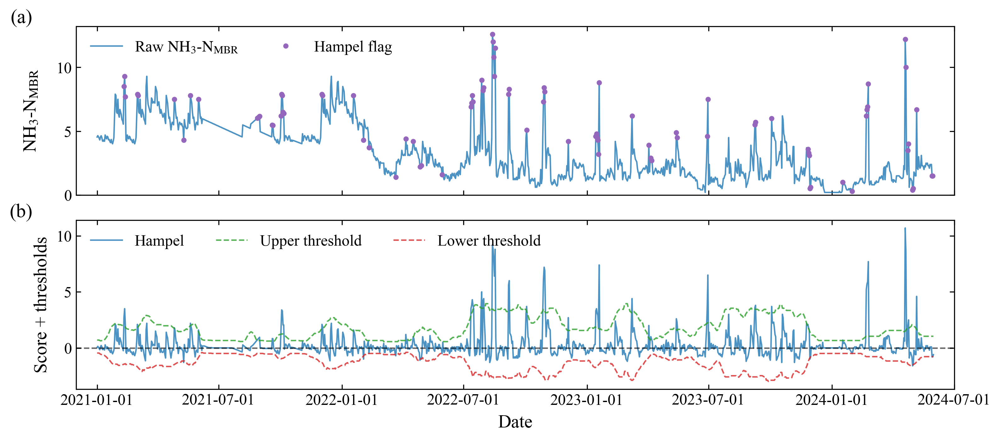

**3_Savgol.png**
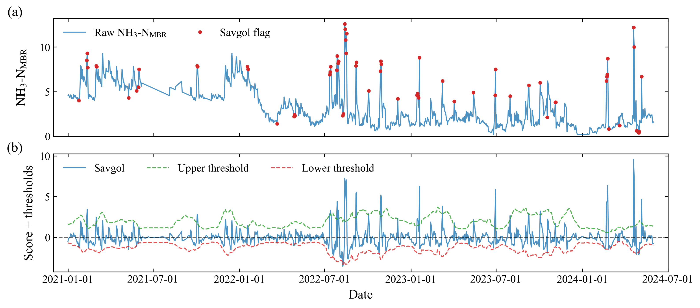

**3_STL.png**
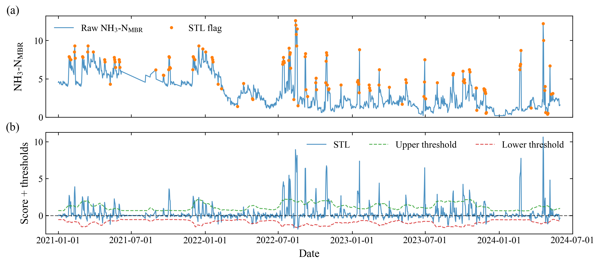

**3_Wavelet-strong.png**
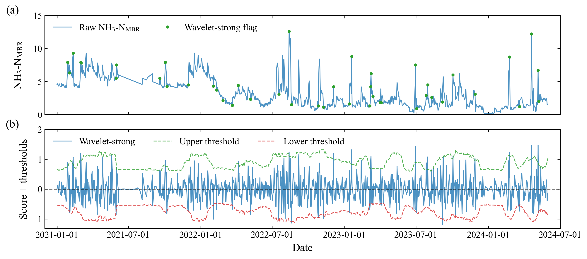

## Plot 4

**4_Hampel.png**
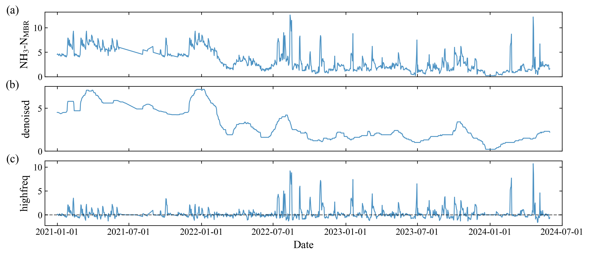

**4_Savgol.png**
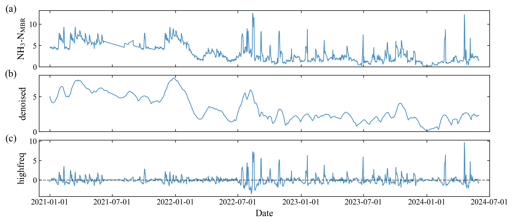

**4_STL.png**
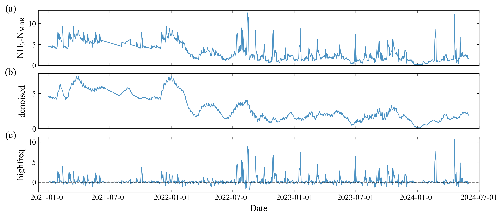

**4_Wavelet-strong.png**
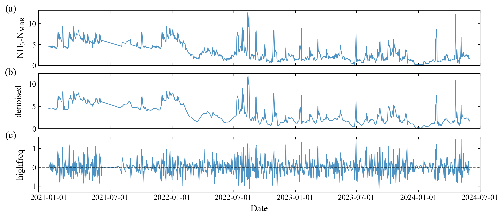

## Plot 5

**5_COD.png**
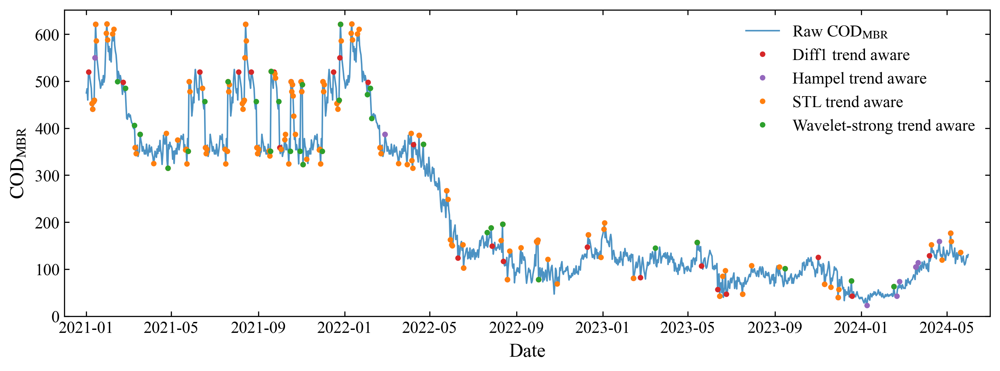

**5_NH3N.png**
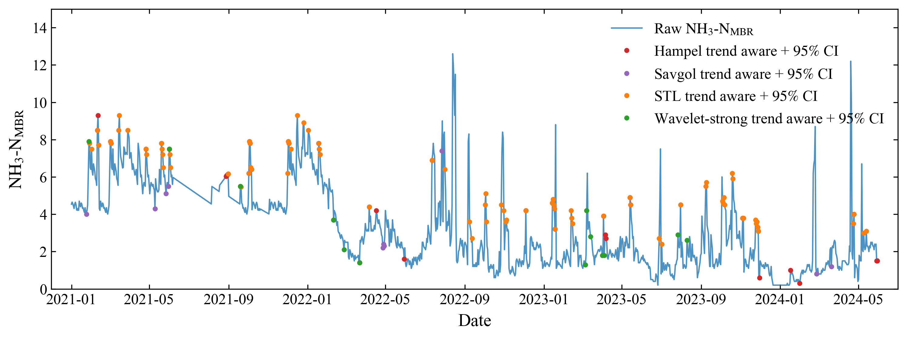
