# Figure 5 — Preview

## Plot 1 — Rolling Mean & Std

**1_CODMBR_rolling.png**
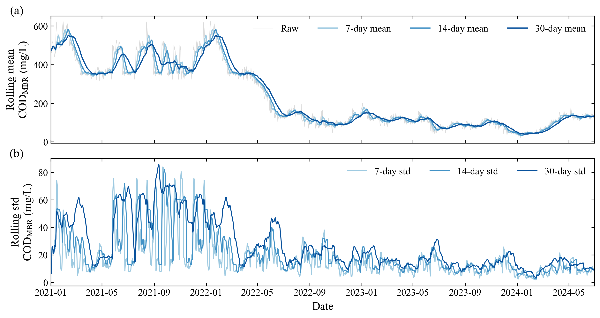

**1_NH3NMBR_rolling.png**
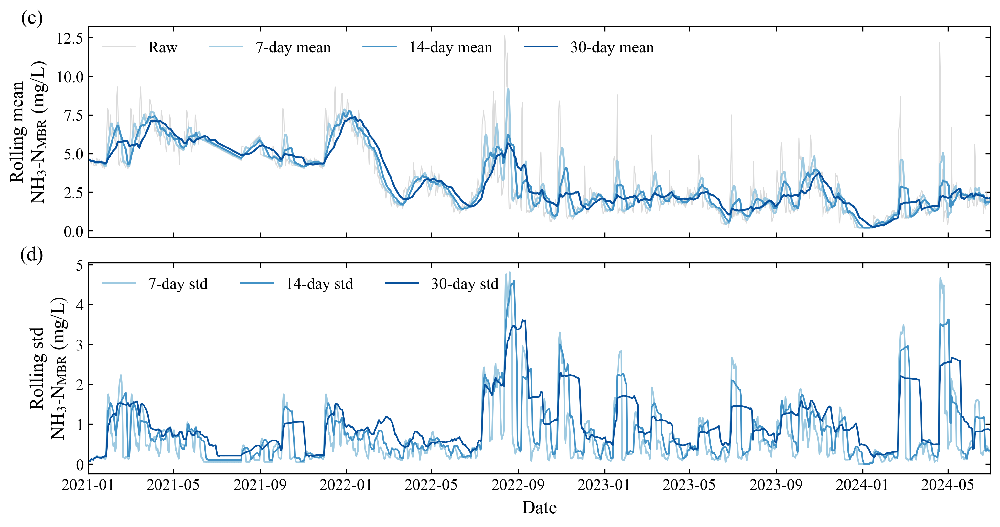

## Plot 2 — Raw Data Scatter

**2_COD.png**
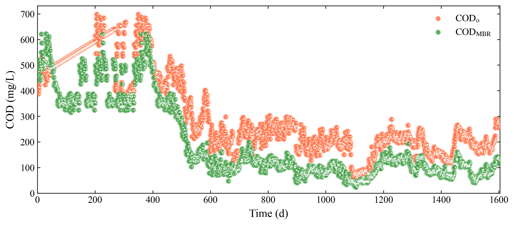

**2_COD_combined.png**
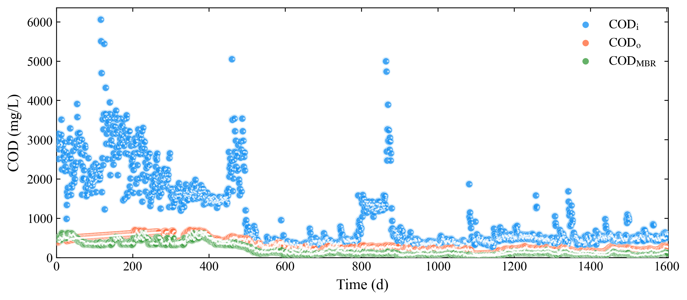

**2_NH3N.png**
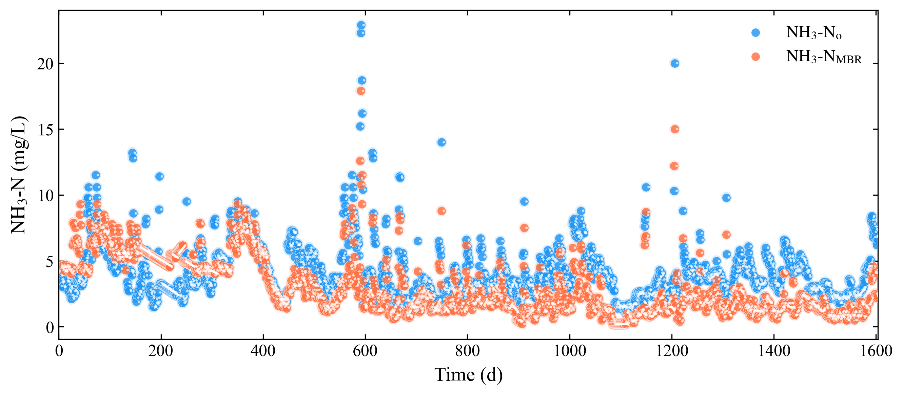

**2_NH3Ni.png**
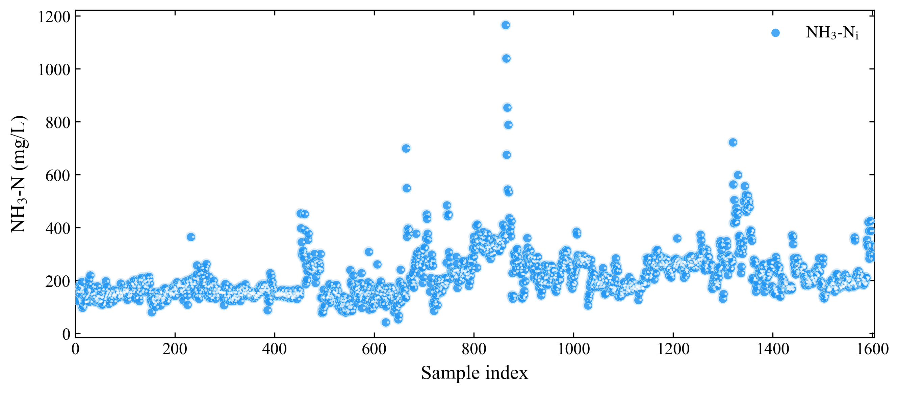

**2_NH3N_combined.png**
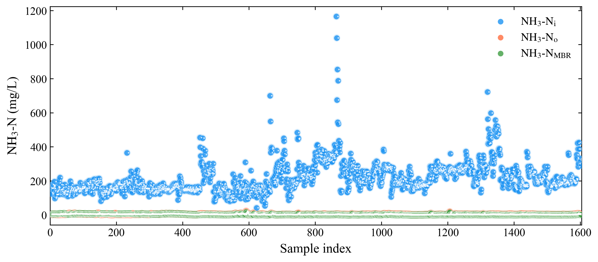

**2_P.png**
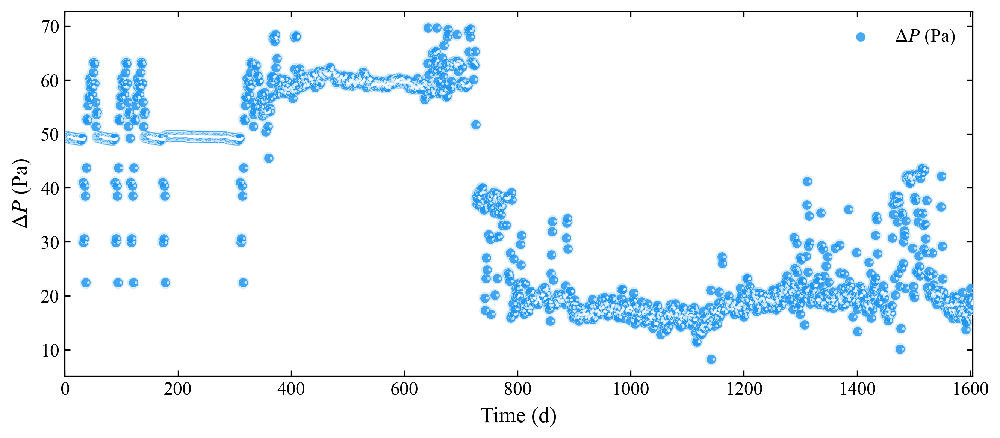

**2_DO.png**
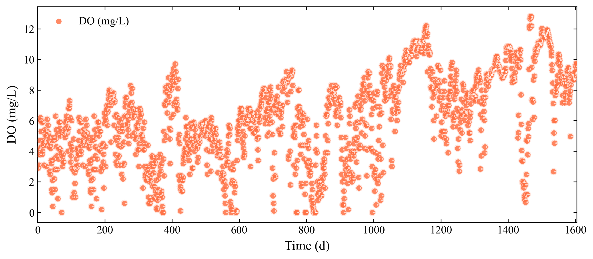

**2_Q.png**
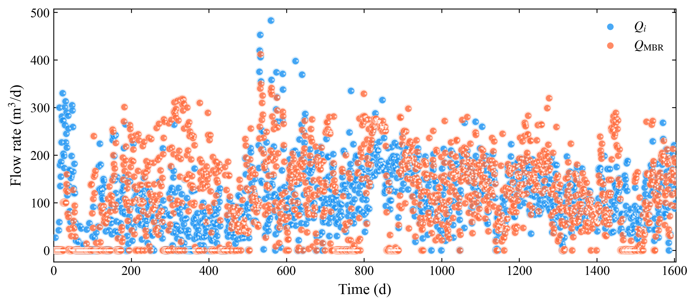

**2_Temp.png**
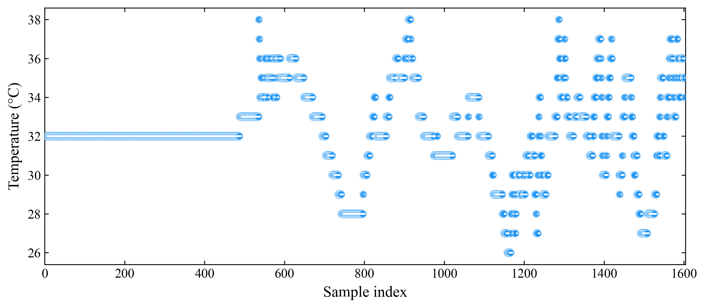

**2_pH.png**
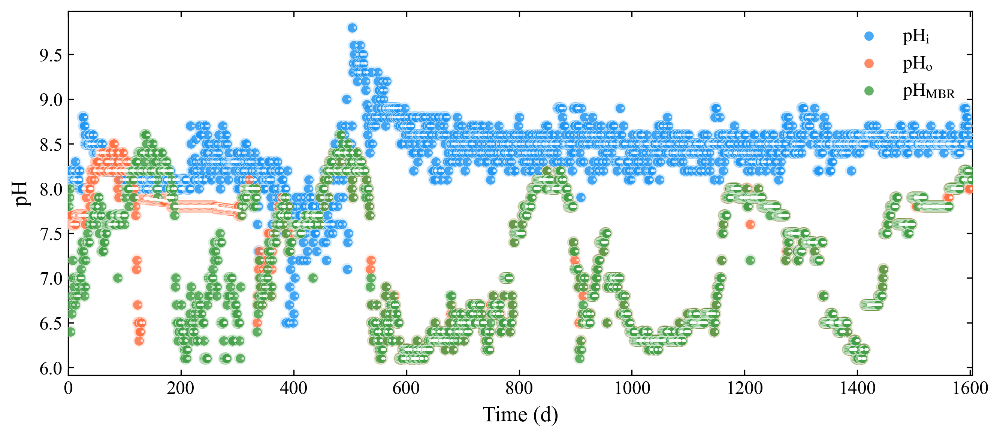

## Plot 3 — Residual Diagnostics

**3_COD.png**
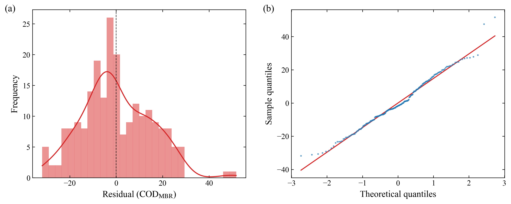

**3_NH3N.png**
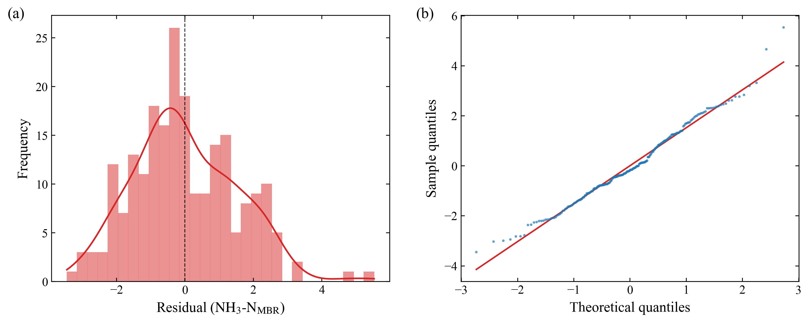

## Plot 4 — Time Series Prediction

**4_COD.png**
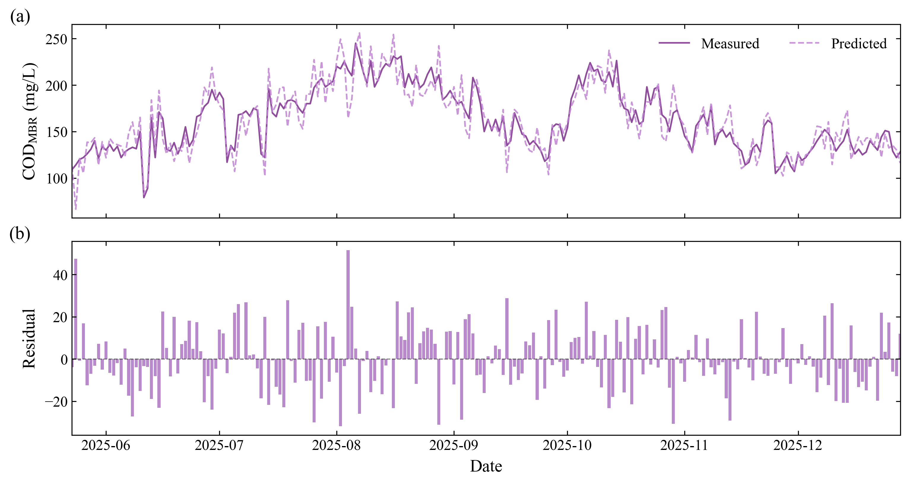

**4_NH3N.png**
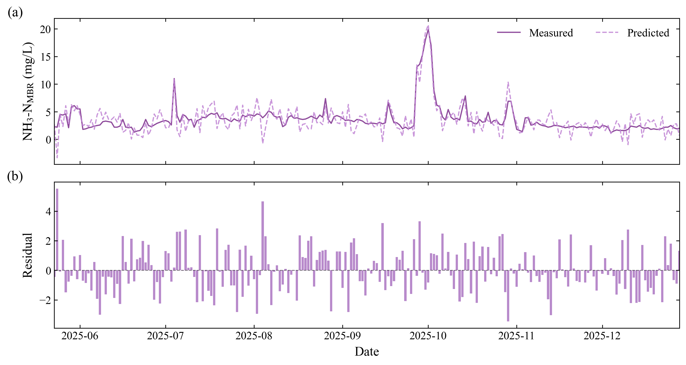

## Plot 5 — Microbial Community

**5_phylum.png**
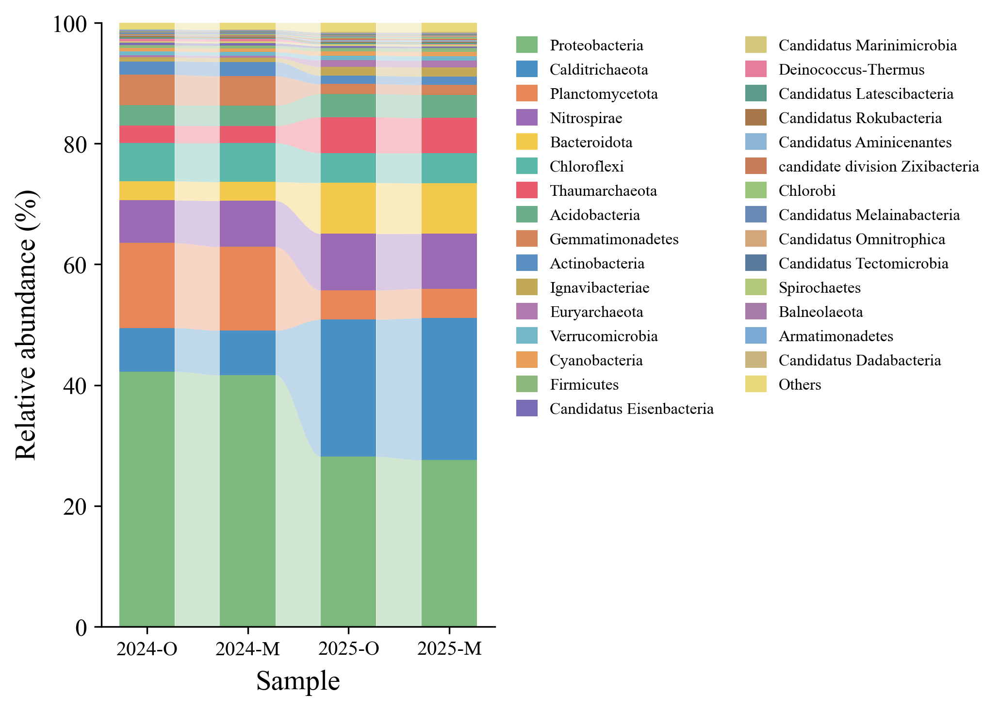

**5_genus.png**
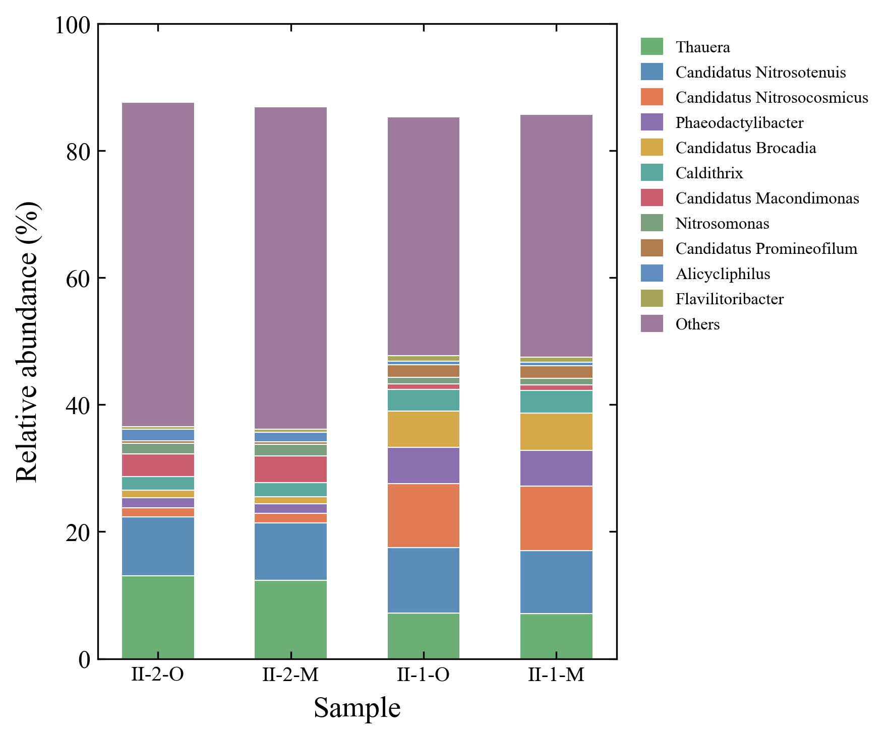
